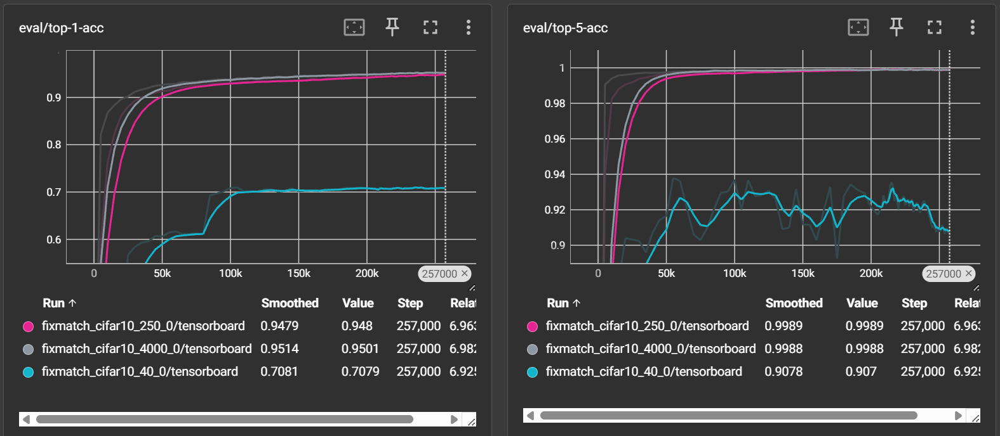

## FixMatch算法核心实现

FixMatch算法的核心在于结合有标签数据和无标签数据进行半监督学习。其主要思想是利用模型自身在无标签数据上的预测来生成伪标签，并通过一致性正则化来训练模型。

具体实现上，算法首先处理有标签数据，通过标准的交叉熵损失进行监督学习，这是模型训练的基础。对于无标签数据，算法则采用了一种特别的策略。每个无标签图像都会被施加两种不同强度的数据增强：一种是弱增强，另一种是强增强。模型首先对弱增强的图像进行预测，并生成一个概率分布。如果模型对这个预测结果的置信度，即最高的预测概率，超过一个预设的阈值，那么这个预测的类别就被当作一个可靠的"伪标签"。然后，算法要求模型对同一样本的强增强图像进行预测，并使其预测结果与之前生成的伪标签保持一致。这个一致性通过计算交叉熵损失来实现，但该损失只在那些通过了置信度阈值筛选的样本上计算。

最终的总损失函数是两部分的加权和：一部分是来自有标签数据的监督损失，另一部分是来自无标签数据的一致性损失。通过这种方式，FixMatch能够有效地利用大量无标签数据，显著提升模型在只有少量标注数据时的性能。

在 `FixMatchTrainer.py` 的 `inference` 函数中，可以看到算法的具体实现。以下是其核心代码逻辑的简化展示：

```python
def inference(self, labeled_batch, unlabeled_batch, model):
    # 有标签数据损失
    labeled_img, labeled_label = labeled_batch
    # ...
    labeled_logits = model(labeled_img)
    Lx = F.cross_entropy(labeled_logits, labeled_label, reduction='mean')
    loss = Lx
    
    # 无标签数据损失
    if unlabeled_batch is not None:
        (img_weak, img_strong), _ = unlabeled_batch
        # ...
        with self.ctx:
            logits_weak = model(img_weak)
            logits_strong = model(img_strong)
            
        # 生成伪标签, .detach() 确保了伪标签的生成过程不被追踪梯度
        pseudo_label = torch.softmax(logits_weak.detach() / self.config.temperature, dim=-1)
        max_probs, max_idx = pseudo_label.max(dim=-1)
        
        # 根据阈值生成掩码
        mask = max_probs.ge(self.config.threshold).float()
        
        # 计算无标签损失
        Lu = F.cross_entropy(logits_strong, max_idx, reduction='none')
        Lu = (Lu * mask).mean()
        
        # 合并损失
        loss += self.config.lambda_u * Lu
            
    return loss, metrics
```

上述代码清晰地展示了损失函数的计算过程。首先，代码计算了有标签数据的监督损失 `Lx`。接着，对于无标签数据，模型分别对弱增强和强增强的图像进行预测。弱增强图像的预测结果 `logits_weak` 用于生成伪标签。这里使用 `.detach()` 来阻止梯度回传到伪标签生成路径，并应用温度缩放（temperature scaling）来锐化概率分布。然后，通过与预设的置信度阈值 `self.config.threshold` 比较，生成一个掩码 `mask` 来筛选出高置信度的伪标签。最后，无标签损失 `Lu` 被计算为强增强图像预测 `logits_strong` 与筛选后的伪标签 `max_idx` 之间的交叉熵，并由掩码 `mask` 进行加权。总损失 `loss` 是有标签损失 `Lx` 与无标签损失 `Lu`（由超参数 `lambda_u` 加权）的和。

## 项目结构

本项目的代码结构清晰且模块化，主要文件和目录的功能说明如下：

-   `main.py`: 项目的启动入口，负责解析命令行参数、加载配置、初始化数据集和模型，并启动训练流程。
-   `config/`: 存放模型的配置文件，通过yaml格式定义了训练过程中的各种超参数，如学习率、批处理大小、模型深度等。
-   `dataset/`: 包含数据加载和预处理的逻辑，负责对CIFAR-10等数据集进行处理，包括数据增强策略的定义。
-   `model/`: 定义了核心的神经网络架构，如本项目中使用的WideResNet模型，以及指数移动平均（EMA）等相关的模型组件。
-   `trainer/`: 包含了核心的训练器实现，`FixMatchTrainer.py`就在其中，它封装了FixMatch算法的完整训练循环、损失计算、评估和检查点保存等逻辑。
-   `utils/`: 存放一些工具函数，供项目其他模块调用。
-   `workspace/`: 用于存放训练过程中产生的日志、保存的模型检查点以及TensorBoard的输出文件。
-   `TorchSSL/`: 包含了一个第三方的TorchSSL实现，用于对比验证本项目复现结果的准确性。
-   `report.md`: 即本实验报告文件，记录了算法的实现细节、训练结果和分析。

## 运行模型

详见 [README](./README.md)

## 训练结果

| 标注数据量 | 本项目复现结果 | TorchSSL运行结果 | FixMatch论文结果 |
| --------- | ------------ | --------------- | --------------- |
| 4000        | 94.84       |     95.12     | 95.74±0.05      |
| 250       | 93.34       |      94.76       | 94.93±0.65      |
| 40      | 84.64       |       66.91     | 86.19±3.37      |

从训练日志的表格数据中可以观察到几种实现的效果。在标注数据较为充足的情况下（如4000个和250个样本），本项目的复现结果与TorchSSL库以及FixMatch论文中报告的结果相差不大，准确率均在93%以上，证明了本项目实现的有效性。特别是在标注数据量下降到250个时，性能只有轻微下降，显示了算法在数据量较少时的鲁棒性。

最有意思的对比体现在仅有40个标注样本的极端情况下。此时，本项目的复现结果（84.64%）显著优于TorchSSL的运行结果（66.91%），并且非常接近原始论文中报告的性能（86.19%）。这表明，本项目的实现在极低数据量场景下的表现尤为出色，可能得益于某些超参数的设置或训练细节的优化，使其相比TorchSSL的实现在这种困难条件下更为稳定和有效。

### 本项目复现日志

更多细节可在 `workspace` 文件夹下运行 tensorboard 查看

step数量：258k


准确率：


### TorchSSL运行日志

更多细节可在 `TorchSSL/saved_models/` 文件夹下运行 tensorboard 查看




## FixMatch与MixMatch

FixMatch与MixMatch两种算法的不同点如下：

FixMatch与MixMatch都是半监督学习领域的经典算法，但它们在利用无标签数据的方式上存在显著差异。MixMatch的核心思想在于"混合"，它会对一张无标签图片进行多次弱数据增强，并将模型的多次预测结果的平均值进行锐化，以此生成一个较为可靠的伪标签。然后，它使用MixUp技术，将有标签样本和带有伪标签的无标签样本进行混合，从而生成新的训练样本，并对这些混合样本计算一致性损失。

相比之下，FixMatch的策略更为直接和简洁。它不对预测进行平均，而是只对无标签样本进行一次弱增强和一次强增强。模型对弱增强样本的预测结果如果置信度足够高，就直接作为伪标签。然后，算法要求模型对该样本的强增强版本做出与伪标签一致的预测。FixMatch不使用MixUp，其损失函数仅由标准监督损失和基于高置信度样本的一致性损失构成，这使得它的概念和实现都相对简单。

